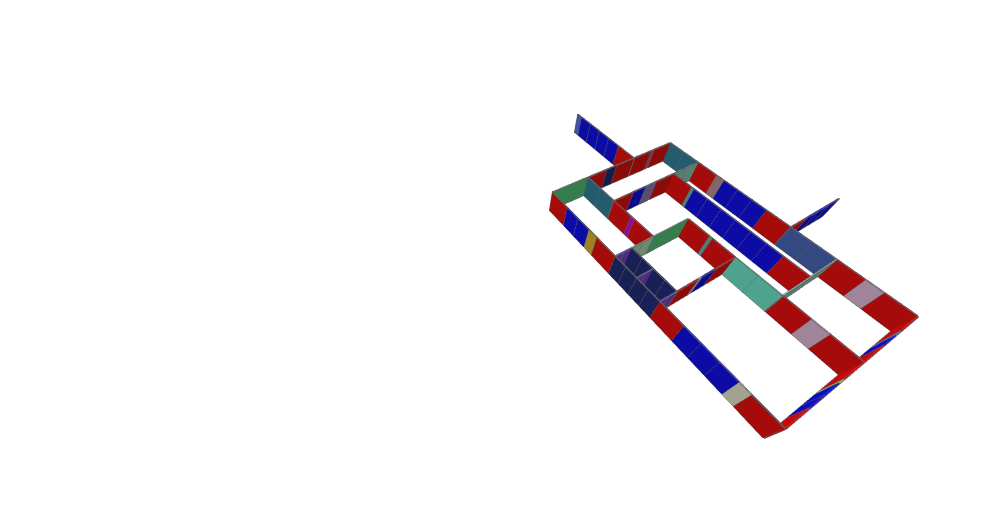

# Panels From Walls

The PanelsFromWalls function.

|Input Name|Type|Description|
|---|---|---|
|Panel Length|Range|The panel length.|
|Corner Length|Range|The length of any leg of a custom section where two or more walls meet.|
|Color-code by Length|Boolean|Set to true to visualize wall sections colored according to their length.|

 

|Output Name|Type|Description|
|---|---|---|
|Panel Count|Number|The total number of panels.|
|Non-Standard Panel Count|Number|The number of panels that are neither the corner nor the designated panel length.|
|Unique Lengths Count|Number|The number of unique panel lengths generated.|

# PanelsFromWalls
